# Running Single Test Files in Cypress

**Last Updated:** September 30, 2025
**Status:** ✅ Production-Ready
**Authority:** Official Cypress CLI Documentation + start-server-and-test Best Practices

---

## Table of Contents

- [Quick Start](#quick-start)
- [The Problem](#the-problem)
- [The Solution](#the-solution)
- [Available Commands](#available-commands)
- [Usage Examples](#usage-examples)
- [How It Works](#how-it-works)
- [Troubleshooting](#troubleshooting)
- [Technical Background](#technical-background)
- [References](#references)

---

## Quick Start

### Run Single Test (Headless)

```bash
SPEC=cypress/e2e/login-page/verify-login-page.cy.ts npm run cypress:run:spec
```

### Run Single Test (Interactive)

```bash
SPEC=cypress/e2e/login-page/verify-login-page.cy.ts npm run cypress:open:spec
```

### Run Multiple Tests (Glob Pattern)

```bash
SPEC=cypress/e2e/auth/*.cy.ts npm run cypress:run:spec
```

---

## The Problem

### Why `npm run cypress:run -- --spec "path"` Doesn't Work

When using `start-server-and-test` to manage server lifecycle, the standard npm argument passing pattern fails:

```bash
# ❌ THIS DOESN'T WORK
npm run cypress:run -- --spec "cypress/e2e/test.cy.ts"
```

**What happens:**

```bash
# The command expands to:
start-server-and-test web http://localhost:3002 'cypress run --browser electron --headless' --spec cypress/e2e/test.cy.ts

# The --spec flag is OUTSIDE the quoted Cypress command
# start-server-and-test doesn't know to inject it into the command string
# Cypress runs without the --spec flag → all tests execute
```

**Root Cause:** Per [start-server-and-test Issue #88](https://github.com/bahmutov/start-server-and-test/issues/88):

> "The `--` npm script argument adds a 4th argument to the command, NOT appending to the 3rd argument."

---

## The Solution

### Shell Script Wrapper (Recommended)

We use shell scripts to properly construct the `start-server-and-test` command with the `--spec` flag:

**File:** `scripts/run-cypress-spec.sh`

```bash
#!/bin/bash

# Run Cypress with specific spec file
if [ -z "$SPEC" ]; then
  echo "Error: SPEC environment variable is required"
  echo "Usage: SPEC=cypress/e2e/test-name.cy.ts npm run cypress:run:spec"
  exit 1
fi

# Properly constructs: start-server-and-test web http://localhost:3002 "cypress run --browser electron --headless --spec $SPEC"
start-server-and-test web http://localhost:3002 "cypress run --browser electron --headless --spec $SPEC"
```

**Why This Works:**

- Environment variable `$SPEC` is expanded by the shell BEFORE passing to `start-server-and-test`
- The entire Cypress command (including --spec) is properly quoted as a single argument
- `start-server-and-test` receives exactly 3 arguments as expected

---

## Available Commands

### E2E Tests - Headless Mode

| Command            | Description                | Usage                                              |
| ------------------ | -------------------------- | -------------------------------------------------- |
| `cypress:run:spec` | Run single spec headless   | `SPEC=path/to/test.cy.ts npm run cypress:run:spec` |
| `test:e2e:spec`    | Alias for cypress:run:spec | `SPEC=path/to/test.cy.ts npm run test:e2e:spec`    |

### E2E Tests - Interactive Mode

| Command              | Description                 | Usage                                                |
| -------------------- | --------------------------- | ---------------------------------------------------- |
| `cypress:open:spec`  | Open single spec in UI      | `SPEC=path/to/test.cy.ts npm run cypress:open:spec`  |
| `test:e2e:open:spec` | Alias for cypress:open:spec | `SPEC=path/to/test.cy.ts npm run test:e2e:open:spec` |

### Traditional Commands (Run All Tests)

| Command        | Description                     |
| -------------- | ------------------------------- |
| `cypress:run`  | Run all E2E tests headless      |
| `cypress:open` | Open Cypress UI to select tests |
| `test:e2e`     | Alias for cypress:run           |

---

## Usage Examples

### Basic Single File

```bash
SPEC=cypress/e2e/homepage.cy.ts npm run cypress:run:spec
```

### Nested Directory

```bash
SPEC=cypress/e2e/login-page/verify-login-page.cy.ts npm run cypress:run:spec
```

### Interactive Mode (Opens Cypress UI with pre-selected test)

```bash
SPEC=cypress/e2e/login-page/verify-login-page.cy.ts npm run cypress:open:spec
```

### Glob Patterns - Multiple Files in Directory

```bash
SPEC=cypress/e2e/auth/*.cy.ts npm run cypress:run:spec
```

### Glob Patterns - All Tests Recursively

```bash
SPEC=cypress/e2e/**/*.cy.ts npm run test:e2e:spec
```

### Glob Patterns - Specific Test Names

```bash
SPEC=cypress/e2e/**/login*.cy.ts npm run cypress:run:spec
```

### Run from Subdirectory

```bash
SPEC=cypress/e2e/user-journeys/complete-signup.cy.ts npm run cypress:run:spec
```

---

## How It Works

### Command Execution Flow

```mermaid
graph LR
    A[User runs SPEC=... npm run cypress:run:spec] --> B[npm executes pre-test:cleanup]
    B --> C[Shell script: scripts/run-cypress-spec.sh]
    C --> D[Shell expands $SPEC environment variable]
    D --> E[Calls start-server-and-test with constructed command]
    E --> F[start-server-and-test starts dev server]
    F --> G[Waits for http://localhost:3002]
    G --> H[Runs: cypress run --spec path/to/test.cy.ts]
    H --> I[Tests execute]
    I --> J[start-server-and-test stops dev server]
    J --> K[Exit with test result code]
```



### Detailed Steps

1. **Pre-test Cleanup**: `npm run pre-test:cleanup`

   - Kills any processes on ports 3002, 3003
   - Stops webpack, react-scripts, Chrome processes
   - Waits 2 seconds for cleanup

2. **Shell Script Execution**: `bash scripts/run-cypress-spec.sh`

   - Validates `$SPEC` environment variable is set
   - Constructs proper `start-server-and-test` command

3. **Server Startup**: `start-server-and-test web http://localhost:3002`

   - Runs `npm run web` (Vite dev server on port 3002)
   - Polls `http://localhost:3002` for HTTP 200 response
   - Proceeds when server is ready

4. **Cypress Execution**: `cypress run --browser electron --headless --spec $SPEC`

   - Launches Cypress with specific test file
   - Runs tests in headless Electron browser
   - Reports results

5. **Cleanup**: `start-server-and-test` automatically stops server
   - Kills Vite dev server process
   - Cleans up resources
   - Exits with Cypress exit code

---

## Troubleshooting

### "SPEC environment variable is required" Error

**Problem:**

```bash
$ npm run cypress:run:spec
Error: SPEC environment variable is required
```

**Solution:**

```bash
# Always prefix command with SPEC=path/to/test
SPEC=cypress/e2e/homepage.cy.ts npm run cypress:run:spec
```

---

### All Tests Run Instead of Single Test

**Problem:** You're using the wrong command pattern.

**Wrong:**

```bash
npm run cypress:run -- --spec "cypress/e2e/test.cy.ts"  # ❌ Runs ALL tests
```

**Correct:**

```bash
SPEC=cypress/e2e/test.cy.ts npm run cypress:run:spec  # ✅ Runs single test
```

---

### "No specs found" Error

**Problem:**

```bash
Can't run because no spec files were found
```

**Causes & Solutions:**

1. **Wrong path** - Verify file exists:

   ```bash
   ls -la cypress/e2e/login-page/verify-login-page.cy.ts
   ```

2. **Wrong file extension** - Must be `.cy.ts`, `.cy.tsx`, `.cy.js`, or `.cy.jsx`:

   ```bash
   # ❌ Wrong
   SPEC=cypress/e2e/test.ts

   # ✅ Correct
   SPEC=cypress/e2e/test.cy.ts
   ```

3. **Glob pattern doesn't match** - Test with `ls`:
   ```bash
   ls cypress/e2e/auth/*.cy.ts  # Verify files match pattern
   ```

---

### Server Doesn't Start

**Problem:**

```bash
Error: Command failed with exit code 1
```

**Solutions:**

1. **Port already in use:**

   ```bash
   lsof -ti :3002 | xargs kill -9  # Kill process on port 3002
   npm run pre-test:cleanup        # Or use cleanup script
   ```

2. **Build errors:**
   ```bash
   npm run web  # Test server starts manually
   # Fix any Vite/TypeScript errors
   ```

---

### Cypress Binary Issues

**Problem:**

```bash
Cypress: bad option: --no-sandbox
```

**Solution:**

```bash
npx cypress install --force  # Reinstall Cypress binary
```

---

## Technical Background

### Why start-server-and-test?

Per [Cypress Best Practices](https://docs.cypress.io/app/references/best-practices):

> "Don't try to start a web server from within Cypress scripts."

**Benefits of start-server-and-test:**

- ✅ Automatic server lifecycle management
- ✅ Waits for server readiness (HTTP 200 check)
- ✅ Guaranteed cleanup (server stops when tests finish)
- ✅ Consistent behavior in CI/CD and local development
- ✅ Prevents port conflicts from orphaned processes

### Why Not `npm run cypress:run -- --spec`?

**Technical Explanation:**

npm's `--` argument separator tells npm to pass remaining arguments to the script command. However:

```bash
# package.json
"cypress:run": "npm run pre-test:cleanup && start-server-and-test web http://localhost:3002 'cypress run --browser electron --headless'"

# When you run:
npm run cypress:run -- --spec "cypress/e2e/test.cy.ts"

# npm expands to:
npm run pre-test:cleanup && start-server-and-test web http://localhost:3002 'cypress run --browser electron --headless' --spec "cypress/e2e/test.cy.ts"
                                                                                                                       ↑
                                                                              --spec is AFTER the quoted string, not INSIDE
```

**start-server-and-test arguments:**

1. `web` - npm script to start server
2. `http://localhost:3002` - URL to poll
3. `'cypress run --browser electron --headless'` - command to run when ready
4. (Extra) `--spec "cypress/e2e/test.cy.ts"` - **IGNORED** (4th argument not expected)

The 4th argument is unexpected and ignored by start-server-and-test.

### Alternative Approaches (Not Used)

#### ❌ Environment Variable in npm Script

```json
"cypress:run:spec": "start-server-and-test web http://localhost:3002 'cypress run --spec ${SPEC}'"
```

**Problem:** npm doesn't expand environment variables in scripts on all platforms.

#### ❌ cross-env-shell

```json
"cypress:run:spec": "cross-env-shell start-server-and-test web http://localhost:3002 \"cypress run --spec $SPEC\""
```

**Problem:** Complex quoting, cross-env-shell argument parsing issues.

#### ✅ Shell Script (CHOSEN)

```json
"cypress:run:spec": "bash scripts/run-cypress-spec.sh"
```

**Advantages:**

- ✅ Works on all Unix-like systems (macOS, Linux)
- ✅ Clean, readable, maintainable
- ✅ Proper error handling
- ✅ Shell variable expansion is guaranteed

---

## References

### Official Documentation

- **Cypress CLI**: https://docs.cypress.io/app/references/command-line
- **Cypress Best Practices**: https://docs.cypress.io/app/references/best-practices
- **start-server-and-test**: https://github.com/bahmutov/start-server-and-test

### Implementation References

- **start-server-and-test Issue #88**: https://github.com/bahmutov/start-server-and-test/issues/88
  - "Allow passing arguments to test script"
- **start-server-and-test Issue #267**: https://github.com/bahmutov/start-server-and-test/issues/267
  - "Pass Arguments To Test Command"

### Project Files

- **Shell Scripts**:
  - `/scripts/run-cypress-spec.sh` - Headless mode
  - `/scripts/open-cypress-spec.sh` - Interactive mode
- **npm Scripts**: `/package.json` lines 52-58
- **Documentation**:
  - `/CLAUDE.md` - Essential commands
  - `/cypress/docs/RUNNING-SINGLE-TESTS.md` - This file

---

## Quick Reference Card

```bash
# ✅ CORRECT - Use These Commands

# Run single test headless
SPEC=cypress/e2e/login-page/verify-login-page.cy.ts npm run cypress:run:spec

# Run single test interactive
SPEC=cypress/e2e/login-page/verify-login-page.cy.ts npm run cypress:open:spec

# Run tests in directory
SPEC=cypress/e2e/auth/*.cy.ts npm run cypress:run:spec

# Run all E2E tests
npm run test:e2e


# ❌ WRONG - Don't Use These

# Bypasses server management
npx cypress run --spec "cypress/e2e/test.cy.ts"

# Doesn't work with start-server-and-test
npm run cypress:run -- --spec "cypress/e2e/test.cy.ts"

# Missing SPEC variable
npm run cypress:run:spec
```

---

**For additional help, see:**

- [CLAUDE.md](../../CLAUDE.md) - Project quick reference
- [cypress-best-practices.md](./cypress-best-practices.md) - Testing best practices
- [CUSTOM-COMMANDS-REFERENCE.md](./CUSTOM-COMMANDS-REFERENCE.md) - Custom Cypress commands
